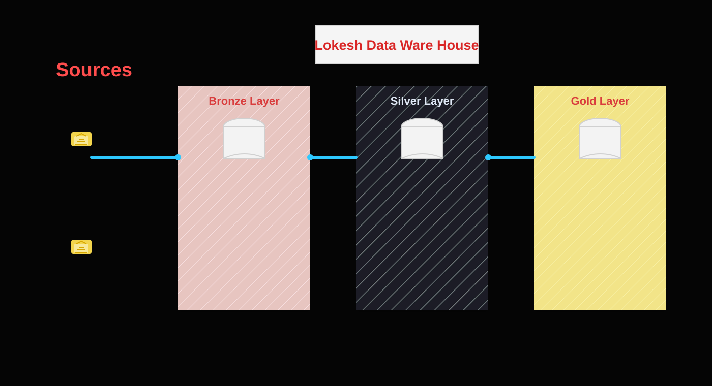

# Lokesh Data Warehouse SQL Project

A complete SQL-based data warehouse project demonstrating database design, schema creation, data loading, ETL processes, data transformation, and analytical reporting.

## 📌 Project Overview

This project builds a data warehouse using SQL. It transforms raw source data into structured, analysis-ready data that can be used for reporting and business insights.

The project covers:

- Database and schema design
- Table creation
- Raw data loading
- Data cleansing and transformation
- ETL pipeline development
- Fact and dimension modeling
- Data quality validation
- Analytical SQL queries

## 🏗️ Data Warehouse Architecture

The project follows a layered architecture:

1. **Bronze Layer**
   Stores raw data exactly as received from source files.

2. **Silver Layer**
   Cleans, standardizes, and transforms the raw data.

3. **Gold Layer**
   Contains business-ready fact and dimension tables for reporting and analysis.

```text
Source Files
     ↓
Bronze Layer
     ↓
Silver Layer
     ↓
Gold Layer
     ↓
Analytical Reports
```

<p align="center">
  
</p>

## 🗂️ Project Structure

```text
├── datasets/
│   └── Source data files
├── scripts/
│   ├── database/
│   ├── bronze/
│   ├── silver/
│   ├── gold/
│   └── analytics/
├── docs/
│   └── Data warehouse documentation
└── README.md
```

## ⚙️ Technologies Used

- SQL
- Relational databases
- Data warehouse concepts
- ETL and ELT processes
- Data modeling
- Analytical SQL

## 🚀 How to Run the Project

1. Clone the repository:

```bash
git clone https://github.com/LokeshwarReddy200630/LokeshDatawareHouse-SQL-Project.git
```

2. Open the project in your SQL development environment.

3. Execute the scripts in the following order:

```text
1. Database and schema creation
2. Bronze layer table creation
3. Raw data loading
4. Silver layer transformations
5. Gold layer table creation
6. Data quality checks
7. Analytical queries
```

4. Review the analytical results generated from the gold layer.

## 🔄 ETL Workflow

The ETL process includes:

- Extracting data from source files
- Loading raw data into staging tables
- Removing duplicate and invalid records
- Handling missing values
- Standardizing data formats
- Joining related datasets
- Creating fact and dimension tables
- Validating the final data

## 📊 Analytical Queries

The project includes SQL queries for analyzing:

- Customer behavior
- Product performance
- Sales trends
- Revenue by category
- Monthly and yearly performance
- Top-performing products and customers

## ✅ Data Quality Checks

The following validations are performed:

- Duplicate record detection
- Null-value checks
- Invalid date checks
- Referential integrity checks
- Data consistency validation
- Record-count comparison between layers

## 🎯 Project Goals

The main goals of this project are to:

- Practice real-world data warehouse development
- Understand ETL pipeline design
- Improve SQL and data transformation skills
- Build analysis-ready data models
- Generate useful business insights from structured data

## 👤 Author

**Lokeshwar Reddy**

GitHub: [@LokeshwarReddy200630](https://github.com/LokeshwarReddy200630)
